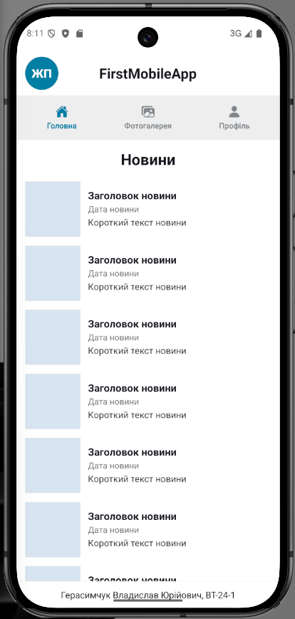
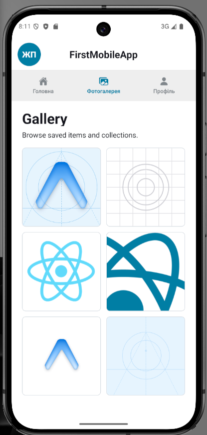
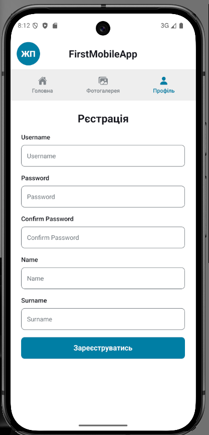

# Лабораторна робота 1: FirstMobileApp

Мобільний застосунок створено на базі Expo, React Native та Expo Router. Проєкт демонструє роботу з верхньою навігацією, окремими екранами, списком новин, галереєю зображень і формою реєстрації.

## Функціональність

- Головний екран з переліком новин, датою, коротким описом і нижнім підписом з даними студента.
- Екран фотогалереї з сіткою зображень із ресурсів застосунку.
- Екран профілю з формою реєстрації: username, password, confirm password, name, surname.
- Верхня панель навігації з трьома вкладками: головна, фотогалерея, профіль.

## Технології

- Expo SDK 54
- React 19
- React Native 0.81
- Expo Router
- React Navigation Material Top Tabs
- TypeScript

## Встановлення залежностей

Перед першим запуском потрібно перейти в папку проєкту та встановити залежності:

```bash
cd lab1
npm install
```

У поточній копії проєкту папка `node_modules` уже присутня, але після перенесення проєкту на інший комп'ютер команду `npm install` потрібно виконати повторно.

## Запуск застосунку

Основний запуск Metro Bundler:

```bash
npm start
```

Після запуску Expo CLI покаже QR-код і список доступних варіантів відкриття застосунку.

## Основні способи запуску мобільного додатка

### Expo Go на фізичному пристрої

Команда:

```bash
npm start
```

Призначення: швидке тестування на реальному смартфоні без створення нативної збірки. Потрібно встановити застосунок Expo Go на Android або iOS і відсканувати QR-код.

Особливості: комп'ютер і телефон мають бути в одній мережі або потрібно використовувати tunnel-режим. Такий спосіб зручний для перевірки зовнішнього вигляду, жестів, прокрутки та поведінки інтерфейсу на реальному екрані.

Відмінність під час тестування: Expo Go не завжди повністю повторює standalone-збірку, особливо якщо у проєкті є нативні модулі, які не входять до Expo Go.

### Android Emulator

Команда:

```bash
npm run android
```

Призначення: запуск застосунку в Android-емуляторі через Expo CLI.

Особливості: потрібні Android Studio, налаштований Android SDK і створений віртуальний пристрій. Зручно перевіряти Android-специфічну поведінку, розміри екранів, системну навігацію та адаптивність.

Відмінність під час тестування: емулятор працює стабільно для повторюваних перевірок, але не завжди точно відображає продуктивність і поведінку сенсорного введення реального пристрою.

### iOS Simulator

Команда:

```bash
npm run ios
```

Призначення: запуск застосунку в iOS Simulator.

Особливості: доступно тільки на macOS із встановленим Xcode. Підходить для перевірки iOS-інтерфейсу, safe area, системних шрифтів і поведінки навігації.

Відмінність під час тестування: iOS Simulator не перевіряє роботу на реальному пристрої повністю, але дозволяє швидко тестувати більшість сценаріїв під iOS.

### Web-версія

Команда:

```bash
npm run web
```

Призначення: запуск React Native застосунку у браузері через React Native Web.

Особливості: зручно для швидкої візуальної перевірки екранів без телефону або емулятора. Браузер дає змогу користуватись DevTools і швидко перевіряти помилки.

Відмінність під час тестування: web-версія не є повною заміною мобільного запуску, бо браузер і мобільна ОС по-різному обробляють жести, навігацію, шрифти та деякі нативні API.

### Production/export-збірка для web

Команда:

```bash
npx expo export --platform web
```

Призначення: створення статичної web-збірки в папці `dist`.

Особливості: використовується для перевірки результату після оптимізації та підготовки до розміщення на хостингу.

Відмінність під час тестування: export-збірка показує поведінку після production-збирання, але не замінює тестування Android/iOS-версій.

## Скрипти package.json

- `npm start` - запуск Expo CLI та Metro Bundler.
- `npm run android` - запуск на Android-емуляторі або підключеному Android-пристрої.
- `npm run ios` - запуск в iOS Simulator або на iOS-пристрої через macOS/Xcode.
- `npm run web` - запуск web-версії у браузері.
- `npm run lint` - перевірка коду за правилами ESLint.
- `npm run reset-project` - службовий скрипт Expo для скидання шаблонного проєкту.

## Структура проєкту

```text
lab1/
  app/                 маршрути Expo Router
  app/(tabs)/          екрани вкладок
  assets/              зображення та іконки застосунку
  components/          спільні UI-компоненти
  constants/           константи теми
  features/            реалізація основних екранів
  screenshots/         зображення екранів для README
```

## Скріншоти екранів

### Головний екран



### Фотогалерея



### Профіль



## Примітки щодо тестування

Під час перевірки застосунку варто запускати його щонайменше у двох середовищах: у браузері для швидкої перевірки верстки та на мобільному пристрої або емуляторі для перевірки реальної поведінки мобільного інтерфейсу. Для лабораторної роботи найшвидший сценарій такий: `npm install`, `npm start`, далі відкриття через Expo Go або web-режим.
