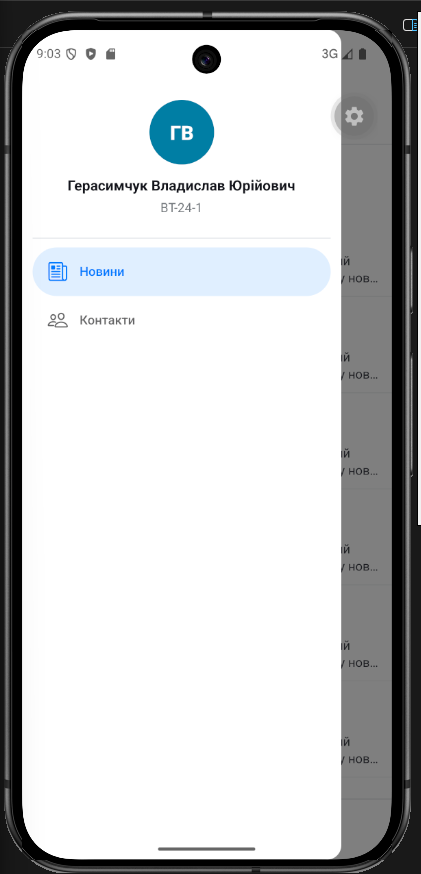

# Лабораторна робота №2

## Тема
Побудова вкладеної навігації та оптимізація відображення великих списків у React Native із використанням FlatList та SectionList.

## Мета
Під час роботи було створено мобільний застосунок на Expo. У застосунку реалізовано навігацію між екранами, список новин через FlatList та список контактів через SectionList.

## Запуск проєкту

```bash
cd MobileLabsRN2026/lab2
npm install
npx expo start
```

Після запуску застосунок можна відкрити через Expo Go на телефоні або через емулятор.

## Реалізовано

- створено Expo-застосунок;
- реалізовано Drawer Navigator;
- для розділу новин використано Stack Navigator;
- створено головний екран зі списком новин через FlatList;
- додано Pull-to-Refresh;
- додано Infinite Scroll;
- використано ListHeaderComponent, ListFooterComponent, ItemSeparatorComponent;
- додано параметри оптимізації FlatList: initialNumToRender, maxToRenderPerBatch, windowSize;
- реалізовано екран деталей новини з передачею параметрів;
- реалізовано екран контактів через SectionList;
- створено кастомне бокове меню з ПІБ, групою і пунктами навігації.

## Скріншоти

Головний екран застосунку:


Бокове меню з навігацією:



Екран контактів:


## Контрольні питання

1. Чим відрізняється FlatList від ScrollView?

FlatList відображає тільки потрібну частину великого списку, тому краще підходить для багатьох елементів. ScrollView одразу рендерить увесь вміст, тому його зручно використовувати для невеликих екранів.

2. Що таке віртуалізація списків?

Віртуалізація списків — це підхід, коли на екрані створюються тільки видимі елементи списку та невеликий запас біля них. Це зменшує навантаження на пам'ять і покращує швидкість роботи.

3. Як здійснюється передача параметрів між екранами?

Параметри передаються під час переходу через `navigation.navigate`. На іншому екрані їх можна отримати через `route.params`.

4. Що таке вкладена навігація?

Вкладена навігація — це коли один навігатор знаходиться всередині іншого. У цій роботі Drawer Navigator містить Stack Navigator для розділу новин.

5. У яких випадках застосовується SectionList?

SectionList використовується, коли список потрібно поділити на секції з окремими заголовками. Наприклад, контакти можна розділити на викладачів, студентів і адміністрацію.

## Висновок

У цій лабораторній роботі я створив застосунок на Expo з кількома екранами. Було реалізовано бокове меню, список новин, детальний екран новини та список контактів. Також я використав оптимізацію FlatList, щоб список працював краще з великою кількістю елементів. У результаті застосунок має просту навігацію і зручне відображення даних.
