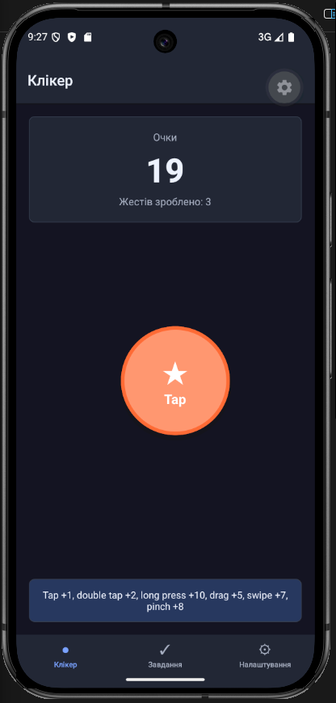
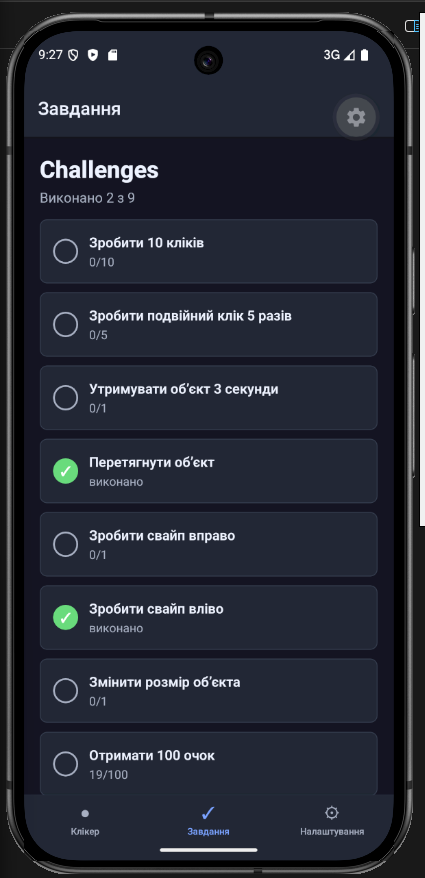
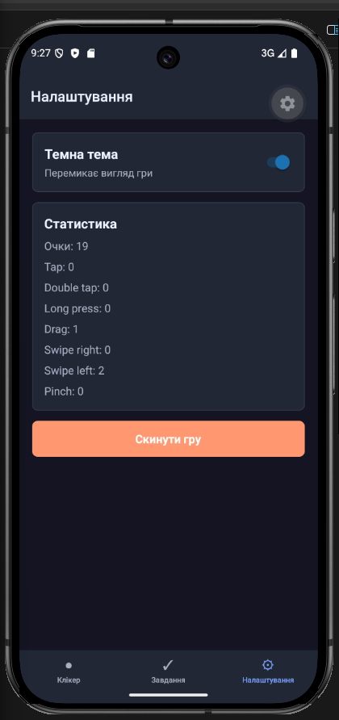
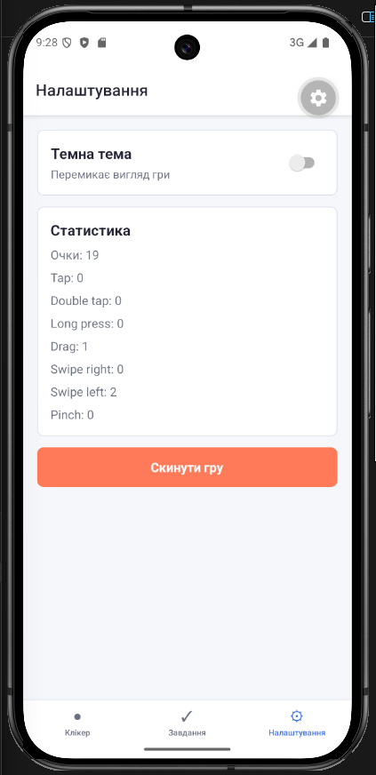

# Лабораторна робота №3

Тема: використання кастомних жестів у React Native та стилізація інтерфейсу мобільного застосунку.

## Інструкція запуску

Спочатку потрібно встановити залежності:

```bash
npm install
```

Після цього можна запустити проєкт:

```bash
npx expo start
```

Застосунок можна відкрити через Expo Go на телефоні або запустити через емулятор Android/iOS.

## Опис реалізованого функціоналу

У лабораторній роботі реалізовано просту гру-клікер на React Native. На головному екрані є лічильник очок і об'єкт, який реагує на різні жести.

Реалізовані жести:

- tap для звичайного кліку;
- double tap для подвійного кліку;
- long press для бонусу;
- pan для перетягування об'єкта;
- fling left/right для свайпів;
- pinch для зміни розміру об'єкта.

Також додано сторінку із завданнями та статусами виконання, сторінку налаштувань, світлу і темну тему та навігацію між екранами.

## Скріншоти роботи застосунку









## Висновки

Під час виконання лабораторної роботи було реалізовано мобільний застосунок на React Native. Було опрацьовано різні типи жестів: натискання, подвійне натискання, утримання, свайпи, перетягування та зміну розміру. Також зроблено навігацію між екранами і сторінку із завданнями. Для інтерфейсу додано просту стилізацію зі світлою і темною темою.
