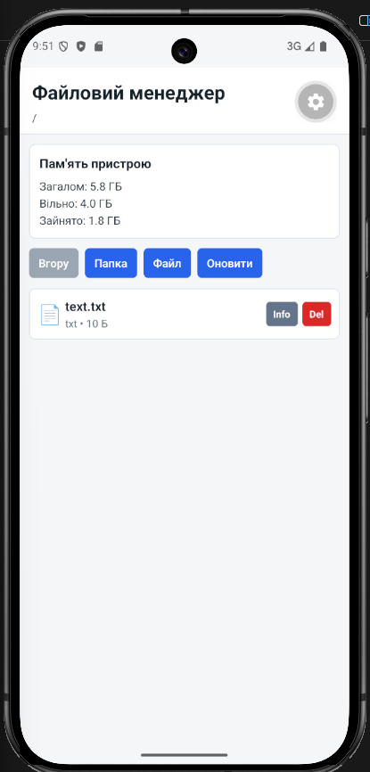
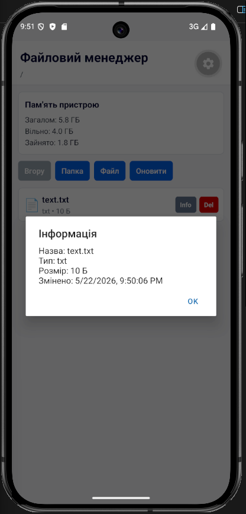
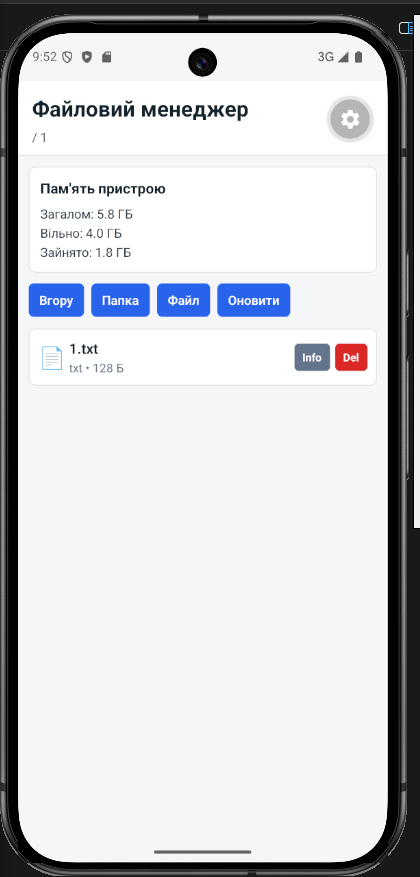
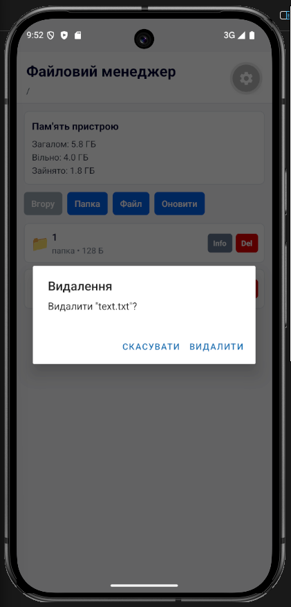

# Лабораторна робота №4

## Тема

Робота з файловою системою в React Native з використанням expo-file-system.

## Запуск проєкту

Спочатку потрібно встановити залежності:

```bash
npm install
```

Після цього можна запустити Expo:

```bash
npx expo start
```

Застосунок можна відкрити через Expo Go на телефоні, відсканувавши QR-код з терміналу.

## Реалізований функціонал

- перегляд поточної директорії;
- навігація між папками;
- створення папок;
- створення `.txt` файлів;
- перегляд текстових файлів;
- редагування і збереження файлів;
- видалення файлів і папок з підтвердженням;
- перегляд інформації про файл або папку;
- перегляд статистики пам'яті.

## Скріншоти роботи застосунку









## Висновок

У цій лабораторній роботі було реалізовано простий файловий менеджер на React Native. Застосунок дозволяє працювати з локальними файлами та папками: створювати, відкривати, редагувати і видаляти їх. Також було додано перегляд інформації про файли і статистику пам'яті пристрою. Під час виконання роботи були закріплені навички роботи з Expo та бібліотекою `expo-file-system`.
