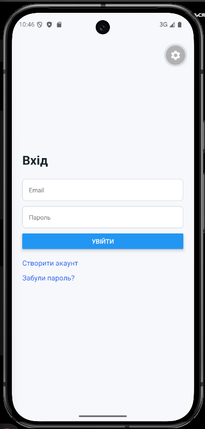
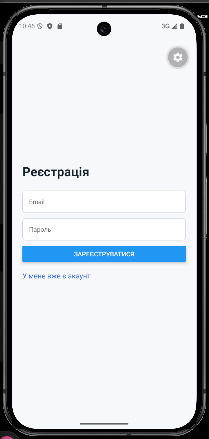
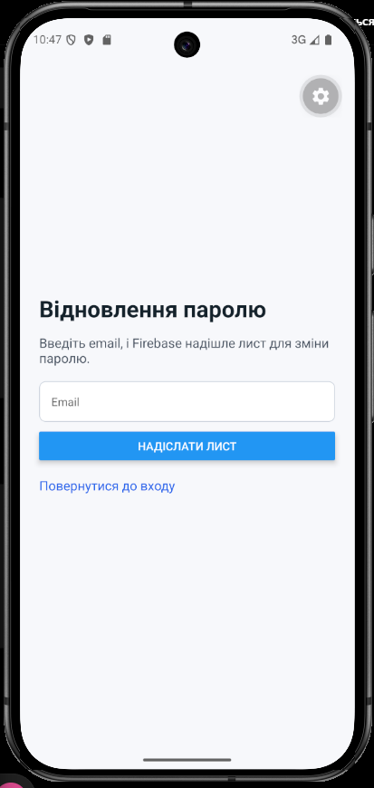
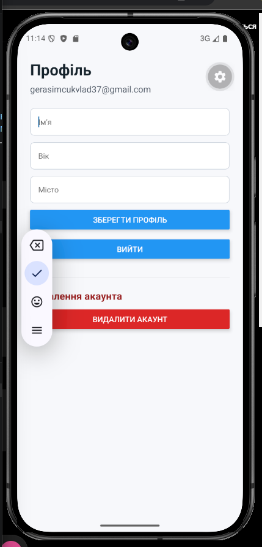
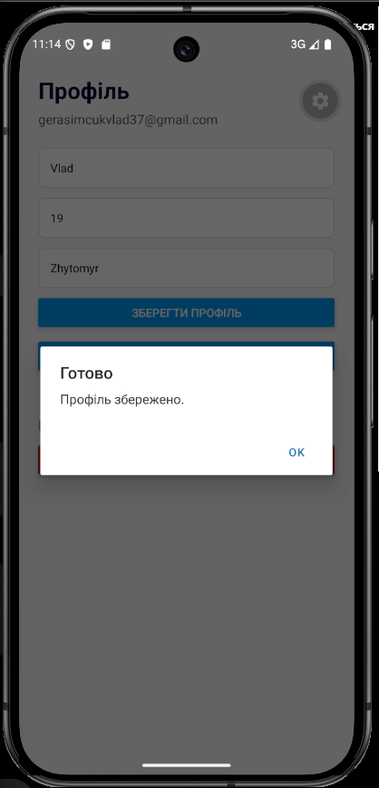

# Лабораторна робота №6

## Тема
Побудова авторизації та збереження персональних даних у React Native з використанням Firebase Authentication та Firestore.

## Мета
Мета роботи - реалізувати мобільний застосунок з авторизацією користувача, роботою з профілем та збереженням персональних даних у Firebase. Також потрібно було додати захист доступу, щоб користувач міг працювати тільки зі своїм документом у Firestore.

## Інструкція запуску
Спочатку потрібно встановити залежності:

```bash
npm install
```

Після цього можна запустити проєкт:

```bash
npx expo start
```

Перед запуском треба створити файл `.env` у корені проєкту і вставити туди Firebase config:

```env
EXPO_PUBLIC_FIREBASE_API_KEY=your_api_key
EXPO_PUBLIC_FIREBASE_AUTH_DOMAIN=your_project_id.firebaseapp.com
EXPO_PUBLIC_FIREBASE_PROJECT_ID=your_project_id
EXPO_PUBLIC_FIREBASE_STORAGE_BUCKET=your_project_id.firebasestorage.app
EXPO_PUBLIC_FIREBASE_MESSAGING_SENDER_ID=your_messaging_sender_id
EXPO_PUBLIC_FIREBASE_APP_ID=your_app_id
```

Ці дані беруться у Firebase Console в `Project settings`. Також у Firebase потрібно увімкнути Authentication через Email/Password і створити Firestore Database.

## Реалізований функціонал
- реєстрація користувача через email і пароль;
- вхід у систему;
- вихід з акаунта;
- відновлення паролю через email;
- збереження профілю користувача у Firestore;
- редагування імені, віку та міста;
- робота тільки з документом поточного користувача через uid;
- видалення акаунта з підтвердженням;
- повторна автентифікація перед видаленням;
- використання Expo Router і AuthContext.

## Структура проєкту
- `app/` — екрани та маршрути Expo Router;
- `app/(auth)` — екрани входу, реєстрації та відновлення паролю;
- `app/(app)` — основні екрани після входу;
- `context/AuthContext.jsx` — збереження стану авторизації;
- `config/firebase.js` — підключення Firebase;
- `firestore.rules` — правила доступу до Firestore.

## Скріншоти роботи застосунку










## Висновки
У цій лабораторній роботі було зроблено застосунок на React Native з використанням Firebase. Я реалізував реєстрацію, вхід, вихід з акаунта і відновлення паролю через Firebase Authentication. Дані профілю користувача зберігаються у Firestore в документі з uid поточного користувача. Також додано перевірку доступу через uid і правила безпеки Firestore. Окремо реалізовано редагування профілю та видалення акаунта з повторною автентифікацією.
