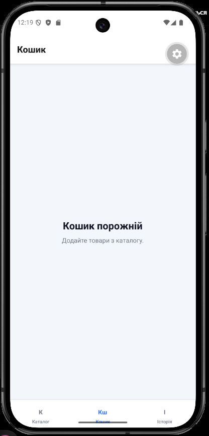
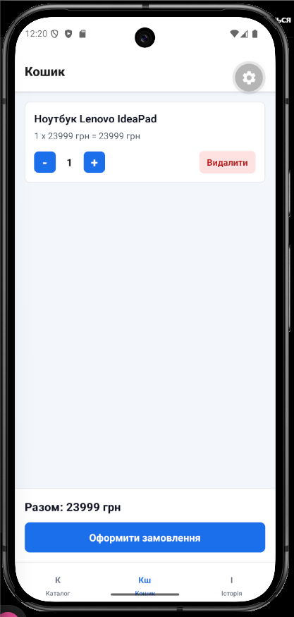
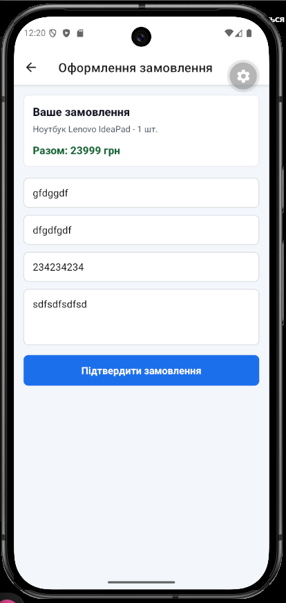
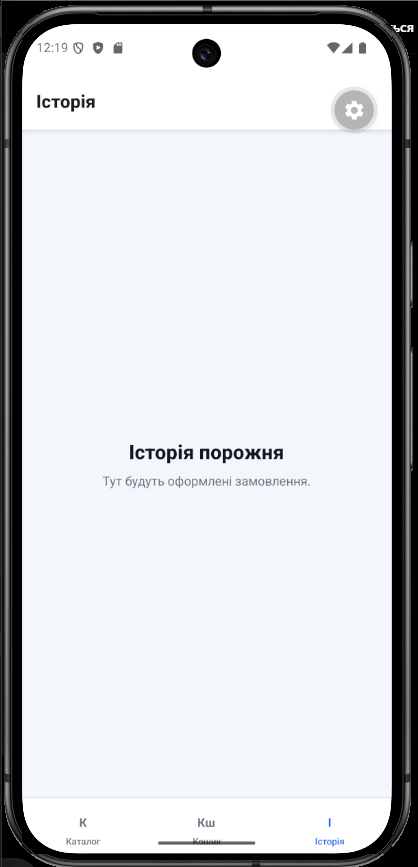
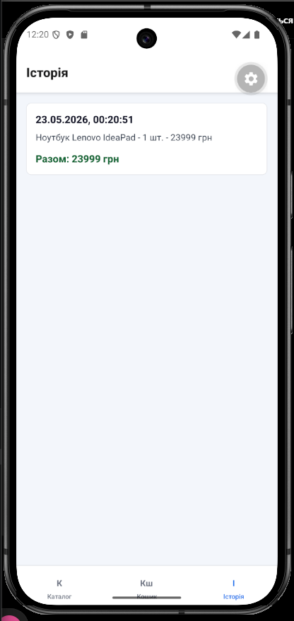

# Лабораторна робота №7

Тема: Використання Redux Toolkit для управління станом при розробці мобільних застосунків.

## Інструкція запуску

Для запуску проєкту потрібно встановити залежності:

```bash
npm install
```

Після цього можна запустити застосунок:

```bash
npx expo start
```

Застосунок можна відкрити через Expo Go на телефоні або запустити через емулятор Android/iOS.

## Опис функціоналу

У застосунку реалізовано:

- каталог товарів;
- перегляд списку товарів;
- перегляд деталей товару;
- додавання товарів у кошик;
- зміна кількості товарів у кошику;
- видалення товарів з кошика;
- автоматичний підрахунок загальної суми;
- оформлення замовлення через форму;
- базова валідація полів;
- очищення кошика після оформлення;
- збереження замовлення в історію;
- перегляд історії замовлень.

## Використані технології

- React Native;
- Expo;
- Expo Router;
- Redux Toolkit;
- React Redux;
- Redux Persist;
- AsyncStorage.

## Redux Store

У проєкті використано кілька slice для зберігання даних:

- productsSlice — зберігає список товарів;
- cartSlice — відповідає за кошик;
- usersSlice — зберігає дані користувача при оформленні замовлення;
- ordersSlice — зберігає історію замовлень.

redux-persist використовується для збереження кошика та історії замовлень після перезапуску застосунку.

## Скріншоти роботи застосунку












## Висновки

Під час виконання лабораторної роботи було розглянуто глобальний стан у React Native застосунку. Redux Toolkit спростив роботу зі станом і зробив код більш зрозумілим. createSlice дозволяє зручно створювати reducers і actions в одному місці. configureStore використовується для налаштування Redux Store та підключення всіх slice. Також було використано redux-persist, щоб зберігати кошик та історію замовлень після перезапуску застосунку.
